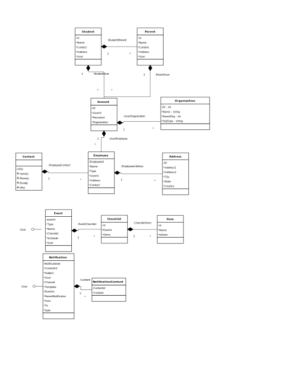

README for schoolAPP
==========================

#Setup you project

##Setup you project - Backend

1. Run below command to configure this project as eclipse
	`gradle eclipse`
2. To build this project run below command
	`gradle build`
3. to start the  front end  and backend both server run below command
	`gradlew bootRun`

##Setup you project - frondEnd
1. install the the required package from node js(which are used in Grunt file/ grunt task)
	`npm install`

2. download front end library used in project
	`bower install`

3. Start frontend server(without backend), that will be used to run the application using mock
	`grunt serv`

#Technologies used
##Client Side technology
1. Yeoman - Used to generate the code (Do not use generator)
2. Grunt - Used to create the required task (build, test, minification, starting the server)
3. Bower - install the javascript library
4. Karma - Used for automation test case
5. AngularJS - Framework for writing the application
6. Bootstrape- Used for CSS and responsive UI

##Server Side technology
1. Gradle - Build tool
2. Spring Boot - Standalon spring application to run as server
3. Liquibase - Handles database schema Update
4. JPA - ORM solution, Hibernate version of JPA is used
5. Spring data JPA - it is so powerful that you don't have to write an implementation   
5. Spring Security - Used for authentication

#Server Side Design

##Bootstraping the server
Spring Boot provide a way to start Java applications quickly and simply, through an embedded server – by default it used an embedded version of Tomcat. With Spring Boot, we can expose components such as REST services independently.

1. The class `SpringApplication` – starting a Spring context and the embedded server,
2. The class with  `@Configuration` annotation indicate to the framework that it is a  configuration(application context class) class.
3. `@EnableAutoConfiguration` -  Enable auto-configuration of the Spring Application Context, attempting to guess and configure beans that you are likely to need.
4.`SpringApplication`  is started through `com.bachpan.Application` as configured in `build.gradle` when we run `gradlew bootRun`

##Web layer
1. Because we are using spring boot, we will not have any web.xml, request will be directly served to controller `@controller` based on url mapping as below
2. Spring boot also use YAML to externalize the properties, any thing configured in yaml file will be injected  as `Environment env` 

##Dao layer (Repository)
### Connection management  
1. Connection properties are configured in  `application-dev.yml`, which will be consumed in `DatabaseConfiguration.java`
2. Application use Spring data JPA for repository, so you just need to inject the Repository interface, it will automatically implement the interface on the fly based on properties available.

##Entity Diagram

